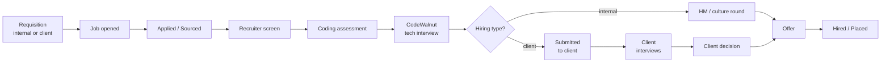

# SPEC — CodeWalnut ATS

Living spec for CodeWalnut's applicant tracking system. The collaborative
draft lives at
<https://claude.ai/code/artifact/e74836b7-6ffb-49d9-ac05-3716346c7660>;
this file is the version the code is built against. When the two differ,
update this file in the same PR as the code that depends on the change.

## Actor & goal

Recruiters, hiring managers, account managers and interviewers at
CodeWalnut run every hire — from a hiring request to a signed offer — in
one system, replacing spreadsheets, email threads and ad-hoc forms. The
firm hires mostly developers at volume, so a technical assessment decides
most outcomes and must be a first-class step, not a side channel.

CodeWalnut hires for **two kinds of employer**, and every job is one of
them:

| Hiring type | Who the hire works for | Who makes the offer | Example |
| --- | --- | --- | --- |
| **Internal** | CodeWalnut | CodeWalnut | A developer for CodeWalnut's own bench or teams |
| **Client — deployed** | CodeWalnut, placed on a client project | CodeWalnut | A React developer on CodeWalnut payroll working for Client A |
| **Client — direct placement** | The client | The client | A tech lead hired onto Client B's payroll |

Client hiring adds steps internal hiring doesn't have: CodeWalnut screens
and tests candidates, **submits** a shortlist to the client, the client
reviews and interviews, and the client's decision drives the outcome.
Clients are records inside CodeWalnut's ATS, not separate tenants; client
users get a narrow, restricted view (see ADR-0002).

### Goals

- One pipeline view per job: every candidate's stage, owner and next step
  visible in under 5 seconds.
- Structured, rubric-based interview feedback so decisions are consistent
  and auditable.
- Lower time-to-hire by automating recruiter admin (scheduling, emails,
  reminders).
- Built-in coding-assessment workflow.
- Funnel reporting (source, conversion, drop-off, time in stage) without
  exporting to Excel — per job, per recruiter and per client.
- Fast, professional client submissions: a branded candidate profile the
  client can review and respond to without email back-and-forth.
- Strict client confidentiality: one client never sees another client's
  jobs, candidates, feedback or rates.

### Success metrics (proposed, confirm with stakeholders)

| Metric | Target (6 months after launch) |
| --- | --- |
| Median time-to-hire | down 30% vs. month-1 baseline |
| Feedback submitted within 24h of interview | ≥ 90% |
| Candidates with complete stage history | 100% |
| Recruiter hours spent scheduling per hire | down 50% |
| Offer acceptance rate | tracked per role, source and client |
| Median time-to-submit (client job opened → first shortlist sent) | ≤ 5 working days |
| Submission-to-client-interview ratio | tracked per client; target set after month 1 |
| Client feedback turnaround on submissions | median ≤ 3 working days |

## Users & roles

Access is role-based and job-scoped, and for client jobs also
client-scoped. Interviewers see only candidates they are assigned to.
Compensation is visible only to Admin, the owning Recruiter, the Account
Manager for that client and the Approver. Client users are external and
see only what has been explicitly submitted to their company.

| Role | Who | Main jobs |
| --- | --- | --- |
| Admin | HR ops lead | Org setup, users, pipeline/email/scorecard templates, integrations |
| Recruiter | TA team | Own jobs, source & screen, move stages, schedule, send offers |
| Hiring Manager | Delivery / engineering lead | Raise requisitions, review shortlists, final hire decision |
| Interviewer | Engineers on the panel | Assigned interviews, candidate profile, submit scorecard |
| Approver | Finance / leadership | Approve requisitions and offers above thresholds |
| Account Manager | CodeWalnut delivery / sales owner of a client | Owns client records and client jobs; approves shortlists before they go to the client; relays client decisions |
| Client Reviewer | External — client's hiring manager or panel | Reviews submitted candidates, gives shortlist decision and feedback, proposes interview slots, records client interview outcomes |
| Candidate | External | Apply, upload CV, book slots, take assessments, accept/decline offer |

| Capability | Admin | Recruiter | Hiring Mgr | Account Mgr | Interviewer | Approver | Client Reviewer |
| --- | --- | --- | --- | --- | --- | --- | --- |
| Create / edit client | Yes | No | No | Own clients | No | No | No |
| Create / edit job | Yes | Yes | Draft (internal) | Draft (own clients) | No | No | No |
| Approve requisition | No | No | No | No | No | Yes | No |
| View candidates | All | Own jobs | Own jobs | Own clients' jobs | Assigned only | Offer stage only | Submitted to their company only |
| Move pipeline stage | Yes | Yes | Yes | Own clients' jobs | No | No | Client stages only |
| Submit to client | Yes | Yes (needs AM approval) | No | Yes | No | No | No |
| Submit scorecard / feedback | Yes | Yes | Yes | Yes | Yes | No | Yes (client stages) |
| See others' feedback | Yes | Yes | Yes | Yes | After submitting own | No | Own company's only |
| View compensation / bill rate | Yes | Own jobs | Configurable | Own clients | No | Yes | Only what the submission shows |
| See candidate contact details | Yes | Yes | Yes | Yes | No | No | No |
| Create offer (CodeWalnut as employer) | Yes | Yes | No | No | No | No | No |
| Approve offer | No | No | Configurable | Configurable | No | Yes | No |
| Export / delete candidate data | Yes | No | No | No | No | No | No |

Interviewers see peer feedback only after submitting their own, to reduce
anchoring bias. Client Reviewers never see CodeWalnut's internal notes,
internal scorecards, other clients, or candidates not submitted to them.

## State change

A **Requisition** is approved into an open **Job**. Each **Application**
(one Candidate × one Job) moves through the job's pipeline stages until it
is hired or closed.

For client jobs, the requisition is raised by the Account Manager from a
client request, and the job carries the client, hiring type and
confidentiality setting.

From any stage an application can go to **Rejected** (reason required —
for client jobs, whether CodeWalnut or the client rejected),
**Withdrawn** or **On hold**. Stages are per job, cloned from a template;
each client can have its own default template (e.g. two client rounds).

**Internal jobs**

| # | Stage | Owner | Exit criteria | Automation |
| --- | --- | --- | --- | --- |
| 1 | Applied / Sourced | Recruiter | CV reviewed | Auto-ack email; duplicate check |
| 2 | Recruiter screen | Recruiter | Notes + notice period + CTC captured | Self-scheduling link |
| 3 | Coding assessment | Recruiter | Score ≥ job threshold | Invite, 24h/48h reminders, auto-advance or flag |
| 4 | Technical interviews (1–3) | Interviewers | All scorecards submitted | Invite + video link; nudges at 2h/24h |
| 5 | HM / culture round | Hiring Manager | Hire / no-hire decision | Debrief summary |
| 6 | Offer | Recruiter + Approver | Offer accepted | Approval chain, e-sign, expiry reminders |
| 7 | Hired | Recruiter | Joining date confirmed | HRMS hand-off; headcount decremented |

**Client jobs** (stages 1–4 as above, then)

| # | Stage | Owner | Exit criteria | Automation |
| --- | --- | --- | --- | --- |
| 5 | Submitted to client | Recruiter → Account Manager approves | Client shortlist decision (shortlist / reject + reason) | Branded submission profile; client notified by email with secure review link; reminder after 2 working days |
| 6 | Client interviews (1–n) | Client Reviewer + Recruiter | Client feedback recorded per round | Slot proposals via review link or recruiter; candidate prep email |
| 7 | Client decision | Account Manager | Select / reject recorded | Notify recruiter and candidate |
| 8a | Offer — deployed (CodeWalnut is employer) | Recruiter + Approver | Offer accepted | Same as internal offer; bill rate and margin captured |
| 8b | Offer — direct placement (client is employer) | Account Manager | Client offer accepted (status tracked; client issues the letter) | Offer status + joining date tracked, no CodeWalnut offer letter |
| 9 | Placed / Hired | Recruiter | Candidate joined | Placement record; guarantee period starts (direct placement) |

**Submissions** are the key client-hiring record: one candidate sent to one
client for one job. A submission holds a snapshot of what the client saw
(profile, CV version, assessment summary; commercials from v1),
so later edits to the candidate don't change what was sent.

Every stage change appends a `StageEvent` (actor, time, reason) — the
source of truth for the activity timeline and funnel metrics.

## Tech stack

Decided in `docs/adr/0001-initial-architecture.md`; module and data-model
detail in `docs/architecture.md`.

| Layer | Choice |
| --- | --- |
| Backend | Spring Boot 3 (Java 21), Maven, Spring Web, Spring Data JPA, Spring Security |
| Frontend | React + TypeScript (Vite) for staff UI and candidate portal |
| Careers pages | Server-rendered by Spring Boot (Thymeleaf) for SEO |
| Database | MySQL 8 (H2 in-memory for local dev and tests), Flyway migrations |
| Background work | MySQL outbox table (`background_task`) + `@Scheduled` workers |
| Auth | Google Workspace SSO for staff; magic links for candidates |
| Search | MySQL `FULLTEXT` on candidates and parsed CVs |
| Files | S3-compatible private storage, signed URLs |
| AI | One `LlmService` (CV parsing, JD drafting, feedback summaries) — advisory only |

## Functional requirements

| Module | Requirement | Priority |
| --- | --- | --- |
| Clients | Client record: name, industry, contacts, account manager, default pipeline template, default scorecard, notes | MVP |
| Clients | Commercial terms per client: engagement model (deployed / direct placement), rate card or fee %, replacement guarantee period | v1 |
| Requisitions | Hiring type (internal / client-deployed / direct placement); client + project; role, level, headcount, budget band or bill rate, target date; approval chain by threshold | MVP |
| Jobs | Create from requisition or template; JD editor; skills; location/remote; pipeline template; hiring team (incl. Account Manager for client jobs) | MVP |
| Jobs | Careers page + shareable link with UTM source; **confidential client jobs** show a generic employer ("a US fintech client") instead of the client's name | MVP |
| Submissions | Build a submission: CodeWalnut-branded profile + CV with contact details removed, recruiter summary, assessment score, availability. No bill rate or CTC shown in the MVP — commercials are shared outside the ATS | MVP |
| Submissions | Per-client setting for showing bill rate, expected CTC or neither on submissions | v1 |
| Clients | Per-client data rules: NDA-protected JDs, own retention period, separate data handling where a contract requires it | v1 |
| Submissions | Account Manager approval before a submission is sent | MVP |
| Submissions | Duplicate-submission guard: warn if the candidate was already submitted to the same client in the last 6 months (configurable), including via another job | MVP |
| Submissions | Candidate consent recorded before submission to a named client | MVP |
| Client review | Secure, expiring magic-link review page per submission batch: shortlist / reject with reason, feedback, proposed interview slots | MVP |
| Client review | Full client portal: client users see all their open jobs, submissions, interview schedule and history | v1 (confirmed not needed for MVP) |
| Client interviews | Record client rounds and outcomes (by Client Reviewer via link, or by recruiter on their behalf) | MVP |
| Jobs | Push to LinkedIn, Naukri, Indeed | v1 |
| Candidates | Profile: contact, CV, GitHub/LinkedIn, experience, current/expected CTC, notice period, tags | MVP |
| Candidates | CV upload + AI-assisted parsing into editable fields | MVP |
| Candidates | Duplicate detection & merge (email, phone, name + company) | MVP |
| Candidates | Talent pool search and re-engagement | v1 |
| Pipeline | Kanban + list per job; drag to move; bulk move/reject/email | MVP |
| Pipeline | Reject with required reason + optional templated email (now or delayed) | MVP |
| Pipeline | Employee referrals with status tracking and bonus eligibility | v1 |
| Assessments | Coding-test provider integration or take-home via GitHub repo link | MVP |
| Assessments | Score pulled back automatically; threshold auto-advance / flag | MVP |
| Interviews | Google / Microsoft calendar free-busy; candidate self-booking; video links | MVP |
| Interviews | Panel rotation and interviewer load-balancing | v1 |
| Scorecards | Rubric per stage (competency, 1–4 rating, notes, recommendation); required before debrief | MVP |
| Scorecards | AI summary of feedback for debrief (never an automated decision) | v1 |
| Offers | Templates with merge fields; CTC breakdown; approval chain; e-sign; expiry; accept/decline | MVP |
| Communication | Email templates; two-way thread sync; activity timeline | MVP |
| Communication | WhatsApp / SMS | Later |
| Candidate portal | Apply form | MVP |
| Candidate portal | Status page, slot booking, document upload | v1 |
| Reports | Funnel, time in stage, time-to-hire, source effectiveness, interviewer load & feedback SLA | v1 |
| Reports | Per-client: open roles, time-to-submit, submissions, submission→interview→offer ratios, client feedback turnaround, placements | v1 |
| Placements | Placement record (start date, guarantee end date, replacement flag); export for invoicing | v1 |
| Placements | Invoicing / billing inside the ATS | Later |
| Reports | Diversity (opt-in, aggregated only) | Later |
| Admin | Users/roles, Google SSO, templates, rejection reasons, custom fields | MVP |
| Admin | Audit log viewer, retention rules, bulk import | MVP |

## Boundaries & failure states

- **Duplicate candidate** on apply or import → matched by email/phone,
  surfaced for merge; never silently creates a second profile.
- **Stage move without required data** (reject without reason, advance past
  interviews with missing scorecards) → rejected by the API with a clear
  error, not just hidden in the UI.
- **Integration down** (calendar, email, assessment provider, e-sign) →
  the job retries with backoff; the application shows a visible
  "action pending / failed" state. Never mark an invite or offer as sent
  when it wasn't.
- **Webhook from a provider** → signature verified, idempotent by external
  id; unknown or replayed events are logged and ignored.
- **CV parsing fails or is low confidence** → the CV is still stored, the
  fields are left for manual entry, and the profile is flagged.
- **Unauthorised access** (interviewer opening an unassigned candidate,
  non-privileged role reading compensation) → `403` from the API and an
  audit entry.
- **Cross-client leakage**: a Client Reviewer (or a forwarded review link)
  requesting any job, candidate or submission not sent to their company →
  `403`/`404` and an audit entry; review links are single-client,
  expiring and revocable.
- **Duplicate submission** of a candidate to the same client → blocked
  until the recruiter confirms with a reason; the earlier submission is
  shown.
- **Client doesn't respond** to a submission → reminders at 2 and 5
  working days, then the Account Manager is alerted; the submission never
  silently auto-rejects.
- **Candidate withdraws consent** for a client → pending submissions to
  that client are withdrawn and the client's review link stops showing
  them.
- **Candidate-supplied content** (CV text, cover letters, emails) is data,
  never instructions — including when passed to an LLM (see `AGENTS.md`).

## Non-functional requirements

Legal baseline assumed: India's DPDP Act 2023, plus GDPR for EU applicants.

| Area | Requirement |
| --- | --- |
| Privacy & consent | Consent captured at apply with timestamp; export/deletion requests completed within 30 days |
| Retention | Rejected candidates anonymised after a configurable period (default 12 months) unless opted into talent pool |
| Access control | RBAC enforced in the API; job-scoped and client-scoped row checks; compensation and bill rates masked by role |
| Client confidentiality | Client names hidden on confidential jobs; client users isolated to their own company's submissions; internal notes and scorecards never shown to clients; client JDs under NDA not published |
| Client-facing output | Submission profiles strip candidate email, phone and links by default; CodeWalnut branding |
| Security | Staff SSO; TLS; encryption at rest; signed expiring file URLs; OWASP Top 10 review before launch |
| Audit | Append-only log of creates, updates, stage moves, compensation views, exports, deletes |
| Uploads | CVs ≤ 10 MB (PDF, DOCX); virus scan before parsing |
| Performance | 500-candidate pipeline board < 1.5 s p95; search < 500 ms on 100k candidates |
| Availability | 99.5% monthly for internal users; careers page on a CDN |
| Backups | Daily snapshots + PITR, 7-day retention; quarterly restore test |
| Accessibility | WCAG 2.1 AA for careers page and candidate portal |
| Fairness | AI never auto-rejects; AI output labelled; rejection reasons logged |

## Not in scope (initially)

- Payroll, HRMS or post-offer onboarding (hand-off by integration only).
- A public job-board marketplace — careers page + pushes to external boards
  only.
- An in-house proctored coding IDE — integrate a provider or use
  take-homes.
- Multi-tenant SaaS where clients run their **own** hiring on the ATS —
  clients only get a restricted review view of what CodeWalnut submits
  (ADR-0002).
- Invoicing and billing (placements are exported for invoicing in v1).
- Vendor-management-system (VMS) integrations with clients' own ATSs.

## Acceptance criteria (system-level)

- Given an approved requisition, when a recruiter publishes the job, then
  it appears on the careers page and a public application creates a
  Candidate + Application in stage 1 with a consent timestamp.
- Given an application with a submitted email that matches an existing
  candidate, then no duplicate profile is created and the recruiter is
  shown a merge prompt.
- Given an interviewer assigned to one application, when they request any
  other candidate, then the API returns `403` and writes an audit entry.
- Given an interviewer who has not submitted their scorecard, when they
  open the debrief, then other interviewers' feedback is hidden.
- Given a rejection without a reason, the API refuses the stage move.
- Given an offer above the approval threshold, it cannot be sent until
  every approver in the chain has approved.
- Given any stage move, a `StageEvent` is persisted and the funnel report
  reflects it.
- Given a client job marked confidential, when it is published, then the
  careers page and job-board posts never show the client's name.
- Given a recruiter builds a submission, when it is sent, then the client
  sees no candidate email, phone or profile links, and the submission
  stores a snapshot of exactly what was shown.
- Given a candidate already submitted to Client A within the guard period,
  when a recruiter submits them to Client A again (any job), then the
  system blocks it until a reason is given.
- Given a Client Reviewer from Client A, when they request a submission,
  candidate or job belonging to Client B, then the API refuses it and
  writes an audit entry.
- Given a direct-placement job, when the client's decision is "select",
  then the application moves to client-offer tracking and no CodeWalnut
  offer letter is generated.
- Given a rejected candidate past the retention period who did not opt in,
  the nightly job anonymises their personal fields and CV.

## Build plan — PR-sized chunks

Rough estimate: MVP in ~12 weeks with 3 engineers + 1 designer; first live
job runs on the ATS in parallel with the old process by week 8. Re-check
estimates after chunk 1. Each chunk ships behind a feature flag with
tests, a short demo, and an ADR for any significant decision.

0. **Foundations** (week 1) — repo, CI, environments, Google SSO, RBAC
   skeleton, audit log, design system. *Done when* a user signs in and sees
   role-based navigation.
1. **Clients, jobs & requisitions** (week 2) — client records, hiring
   type, requisition + approval, job CRUD, per-client pipeline templates,
   careers page (with confidential jobs), apply form. *Done when* a public
   applicant appears on an internal job and on a confidential client job.
2. **Candidates & pipeline** (weeks 3–4) — profiles, CV upload + parsing,
   dedupe, Kanban, stage moves, reject flow, activity timeline. *Done when*
   a recruiter runs a full pipeline without a spreadsheet.
3. **Email** (week 5) — templates, outbound, thread sync, auto-ack. *Done
   when* all candidate emails live on the timeline.
4. **Interviews & scorecards** (weeks 6–7) — calendar integration,
   self-booking, scorecards, nudges, debrief view. *Done when* a panel
   interview is scheduled and scored in-app.
5. **Assessments** (week 8) — provider integration or take-home flow,
   score webhook, thresholds. *Done when* the pilot job goes live in
   parallel.
6. **Client submissions & review** (weeks 9–10) — submission builder,
   redacted branded profile, AM approval, duplicate-submission guard,
   client magic-link review page, client interview rounds and decisions.
   *Done when* a real client shortlists a candidate through the review
   link.
7. **Offers & placements** (week 11) — templates, approval chain, e-sign,
   client-offer tracking for direct placements, hired hand-off. *Done
   when* an internal offer is signed end to end and a direct placement is
   recorded.
8. **Hardening** (week 12) — retention jobs, export/delete, perf tests,
   security review, data import. *Done when* the launch checklist is
   signed off.
9. **v1** (weeks 13–18) — reports (incl. per-client), full client
   portal, commercial terms + placement export, job boards, Slack,
   referrals, talent pool, candidate portal, AI summaries, HRMS — ordered
   by pilot feedback.

## Open questions

- [ ] Build vs. buy: why not Greenhouse, Lever, Zoho Recruit or Keka Hire?
- [ ] Volume: open roles, applicants/month, number of recruiters?
- [x] Internal only, or also for clients? → **CodeWalnut also hires for
  clients** (ADR-0002: single CodeWalnut-run ATS, clients as records with
  restricted review access).
- [x] Which client engagement models are used? → **Both** deployed on
  CodeWalnut payroll and direct placement; both are MVP.
- [x] Should clients log in in the MVP? → **No — the review link is
  enough.** No client accounts or passwords in the MVP; the full client
  portal stays in v1.
- [ ] *(v1)* Should submissions show bill rate, expected CTC or neither,
  per client? MVP shows neither.
- [ ] Duplicate-submission guard period per client (default 6 months)?
- [ ] *(v1)* Which clients need data kept separately (NDA on JDs, own
  retention period, contractual data residency)? MVP applies the standard
  retention and confidentiality rules to every client.
- [ ] Current coding-assessment tool, if any?
- [ ] Google Workspace or Microsoft 365?
- [ ] Existing HRMS and e-sign provider?
- [ ] Offer approval thresholds — who approves, above what CTC/level?
- [ ] Existing candidate data to migrate, and how many records?
- [ ] Hosting preference; ISO 27001 / SOC 2 or client compliance constraints?
- [ ] Product owner and pilot recruiter?
