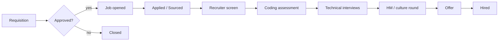

# SPEC — CodeWalnut ATS

Living spec for CodeWalnut's applicant tracking system. The collaborative
draft lives at
<https://claude.ai/code/artifact/e74836b7-6ffb-49d9-ac05-3716346c7660>;
this file is the version the code is built against. When the two differ,
update this file in the same PR as the code that depends on the change.

## Actor & goal

Recruiters, hiring managers and interviewers at CodeWalnut run every hire
— from a hiring request to a signed offer — in one system, replacing
spreadsheets, email threads and ad-hoc forms. The firm hires mostly
developers at volume, so a technical assessment decides most outcomes and
must be a first-class step, not a side channel.

### Goals

- One pipeline view per job: every candidate's stage, owner and next step
  visible in under 5 seconds.
- Structured, rubric-based interview feedback so decisions are consistent
  and auditable.
- Lower time-to-hire by automating recruiter admin (scheduling, emails,
  reminders).
- Built-in coding-assessment workflow.
- Funnel reporting (source, conversion, drop-off, time in stage) without
  exporting to Excel.

### Success metrics (proposed, confirm with stakeholders)

| Metric | Target (6 months after launch) |
| --- | --- |
| Median time-to-hire | down 30% vs. month-1 baseline |
| Feedback submitted within 24h of interview | ≥ 90% |
| Candidates with complete stage history | 100% |
| Recruiter hours spent scheduling per hire | down 50% |
| Offer acceptance rate | tracked per role and source |

## Users & roles

Access is role-based and job-scoped. Interviewers see only candidates they
are assigned to. Compensation is visible only to Admin, the owning
Recruiter and the Approver (Hiring Manager configurable).

| Role | Who | Main jobs |
| --- | --- | --- |
| Admin | HR ops lead | Org setup, users, pipeline/email/scorecard templates, integrations |
| Recruiter | TA team | Own jobs, source & screen, move stages, schedule, send offers |
| Hiring Manager | Delivery / engineering lead | Raise requisitions, review shortlists, final hire decision |
| Interviewer | Engineers on the panel | Assigned interviews, candidate profile, submit scorecard |
| Approver | Finance / leadership | Approve requisitions and offers above thresholds |
| Candidate | External | Apply, upload CV, book slots, take assessments, accept/decline offer |

| Capability | Admin | Recruiter | Hiring Manager | Interviewer | Approver |
| --- | --- | --- | --- | --- | --- |
| Create / edit job | Yes | Yes | Draft only | No | No |
| Approve requisition | No | No | No | No | Yes |
| View candidates | All | Own jobs | Own jobs | Assigned only | Offer stage only |
| Move pipeline stage | Yes | Yes | Yes | No | No |
| Submit scorecard | Yes | Yes | Yes | Yes | No |
| See others' feedback | Yes | Yes | Yes | After submitting own | No |
| View compensation | Yes | Own jobs | Configurable | No | Yes |
| Create offer | Yes | Yes | No | No | No |
| Approve offer | No | No | Configurable | No | Yes |
| Export / delete candidate data | Yes | No | No | No | No |

Interviewers see peer feedback only after submitting their own, to reduce
anchoring bias.

## State change

A **Requisition** is approved into an open **Job**. Each **Application**
(one Candidate × one Job) moves through the job's pipeline stages until it
is hired or closed.

From any stage an application can go to **Rejected** (reason required),
**Withdrawn** or **On hold**. Stages are per job, cloned from a template.

| # | Stage | Owner | Exit criteria | Automation |
| --- | --- | --- | --- | --- |
| 1 | Applied / Sourced | Recruiter | CV reviewed | Auto-ack email; duplicate check |
| 2 | Recruiter screen | Recruiter | Notes + notice period + CTC captured | Self-scheduling link |
| 3 | Coding assessment | Recruiter | Score ≥ job threshold | Invite, 24h/48h reminders, auto-advance or flag |
| 4 | Technical interviews (1–3) | Interviewers | All scorecards submitted | Invite + video link; nudges at 2h/24h |
| 5 | HM / culture round | Hiring Manager | Hire / no-hire decision | Debrief summary |
| 6 | Offer | Recruiter + Approver | Offer accepted | Approval chain, e-sign, expiry reminders |
| 7 | Hired | Recruiter | Joining date confirmed | HRMS hand-off; headcount decremented |

Every stage change appends a `StageEvent` (actor, time, reason) — the
source of truth for the activity timeline and funnel metrics.

## Tech stack

Decided in `docs/adr/0001-initial-architecture.md`; module and data-model
detail in `docs/architecture.md`.

| Layer | Choice |
| --- | --- |
| Backend | Spring Boot 3 (Java 21), Maven, Spring Web, Spring Data JPA, Spring Security |
| Frontend | React + TypeScript (Vite) for staff UI and candidate portal |
| Careers pages | Server-rendered by Spring Boot (Thymeleaf) for SEO |
| Database | MySQL 8 (H2 in-memory for local dev and tests), Flyway migrations |
| Background work | MySQL outbox table (`background_task`) + `@Scheduled` workers |
| Auth | Google Workspace SSO for staff; magic links for candidates |
| Search | MySQL `FULLTEXT` on candidates and parsed CVs |
| Files | S3-compatible private storage, signed URLs |
| AI | One `LlmService` (CV parsing, JD drafting, feedback summaries) — advisory only |

## Functional requirements

| Module | Requirement | Priority |
| --- | --- | --- |
| Requisitions | Role, level, headcount, budget band, client/project, target date; approval chain by threshold | MVP |
| Jobs | Create from requisition or template; JD editor; skills; location/remote; pipeline template; hiring team | MVP |
| Jobs | Careers page + shareable link with UTM source | MVP |
| Jobs | Push to LinkedIn, Naukri, Indeed | v1 |
| Candidates | Profile: contact, CV, GitHub/LinkedIn, experience, current/expected CTC, notice period, tags | MVP |
| Candidates | CV upload + AI-assisted parsing into editable fields | MVP |
| Candidates | Duplicate detection & merge (email, phone, name + company) | MVP |
| Candidates | Talent pool search and re-engagement | v1 |
| Pipeline | Kanban + list per job; drag to move; bulk move/reject/email | MVP |
| Pipeline | Reject with required reason + optional templated email (now or delayed) | MVP |
| Pipeline | Employee referrals with status tracking and bonus eligibility | v1 |
| Assessments | Coding-test provider integration or take-home via GitHub repo link | MVP |
| Assessments | Score pulled back automatically; threshold auto-advance / flag | MVP |
| Interviews | Google / Microsoft calendar free-busy; candidate self-booking; video links | MVP |
| Interviews | Panel rotation and interviewer load-balancing | v1 |
| Scorecards | Rubric per stage (competency, 1–4 rating, notes, recommendation); required before debrief | MVP |
| Scorecards | AI summary of feedback for debrief (never an automated decision) | v1 |
| Offers | Templates with merge fields; CTC breakdown; approval chain; e-sign; expiry; accept/decline | MVP |
| Communication | Email templates; two-way thread sync; activity timeline | MVP |
| Communication | WhatsApp / SMS | Later |
| Candidate portal | Apply form | MVP |
| Candidate portal | Status page, slot booking, document upload | v1 |
| Reports | Funnel, time in stage, time-to-hire, source effectiveness, interviewer load & feedback SLA | v1 |
| Reports | Diversity (opt-in, aggregated only) | Later |
| Admin | Users/roles, Google SSO, templates, rejection reasons, custom fields | MVP |
| Admin | Audit log viewer, retention rules, bulk import | MVP |

## Boundaries & failure states

- **Duplicate candidate** on apply or import → matched by email/phone,
  surfaced for merge; never silently creates a second profile.
- **Stage move without required data** (reject without reason, advance past
  interviews with missing scorecards) → rejected by the API with a clear
  error, not just hidden in the UI.
- **Integration down** (calendar, email, assessment provider, e-sign) →
  the job retries with backoff; the application shows a visible
  "action pending / failed" state. Never mark an invite or offer as sent
  when it wasn't.
- **Webhook from a provider** → signature verified, idempotent by external
  id; unknown or replayed events are logged and ignored.
- **CV parsing fails or is low confidence** → the CV is still stored, the
  fields are left for manual entry, and the profile is flagged.
- **Unauthorised access** (interviewer opening an unassigned candidate,
  non-privileged role reading compensation) → `403` from the API and an
  audit entry.
- **Candidate-supplied content** (CV text, cover letters, emails) is data,
  never instructions — including when passed to an LLM (see `AGENTS.md`).

## Non-functional requirements

Legal baseline assumed: India's DPDP Act 2023, plus GDPR for EU applicants.

| Area | Requirement |
| --- | --- |
| Privacy & consent | Consent captured at apply with timestamp; export/deletion requests completed within 30 days |
| Retention | Rejected candidates anonymised after a configurable period (default 12 months) unless opted into talent pool |
| Access control | RBAC enforced in the API; job-scoped row checks; compensation masked by role |
| Security | Staff SSO; TLS; encryption at rest; signed expiring file URLs; OWASP Top 10 review before launch |
| Audit | Append-only log of creates, updates, stage moves, compensation views, exports, deletes |
| Uploads | CVs ≤ 10 MB (PDF, DOCX); virus scan before parsing |
| Performance | 500-candidate pipeline board < 1.5 s p95; search < 500 ms on 100k candidates |
| Availability | 99.5% monthly for internal users; careers page on a CDN |
| Backups | Daily snapshots + PITR, 7-day retention; quarterly restore test |
| Accessibility | WCAG 2.1 AA for careers page and candidate portal |
| Fairness | AI never auto-rejects; AI output labelled; rejection reasons logged |

## Not in scope (initially)

- Payroll, HRMS or post-offer onboarding (hand-off by integration only).
- A public job-board marketplace — careers page + pushes to external boards
  only.
- An in-house proctored coding IDE — integrate a provider or use
  take-homes.
- Multi-tenant SaaS for CodeWalnut clients — open question below; if it
  becomes in scope it must be decided before chunk 1 because it changes
  the data model.

## Acceptance criteria (system-level)

- Given an approved requisition, when a recruiter publishes the job, then
  it appears on the careers page and a public application creates a
  Candidate + Application in stage 1 with a consent timestamp.
- Given an application with a submitted email that matches an existing
  candidate, then no duplicate profile is created and the recruiter is
  shown a merge prompt.
- Given an interviewer assigned to one application, when they request any
  other candidate, then the API returns `403` and writes an audit entry.
- Given an interviewer who has not submitted their scorecard, when they
  open the debrief, then other interviewers' feedback is hidden.
- Given a rejection without a reason, the API refuses the stage move.
- Given an offer above the approval threshold, it cannot be sent until
  every approver in the chain has approved.
- Given any stage move, a `StageEvent` is persisted and the funnel report
  reflects it.
- Given a rejected candidate past the retention period who did not opt in,
  the nightly job anonymises their personal fields and CV.

## Build plan — PR-sized chunks

Rough estimate: MVP in ~10 weeks with 3 engineers + 1 designer; first live
job runs on the ATS in parallel with the old process by week 8. Re-check
estimates after chunk 1. Each chunk ships behind a feature flag with
tests, a short demo, and an ADR for any significant decision.

0. **Foundations** (week 1) — repo, CI, environments, Google SSO, RBAC
   skeleton, audit log, design system. *Done when* a user signs in and sees
   role-based navigation.
1. **Jobs & requisitions** (week 2) — requisition + approval, job CRUD,
   pipeline templates, careers page, apply form. *Done when* a public
   applicant appears on a job.
2. **Candidates & pipeline** (weeks 3–4) — profiles, CV upload + parsing,
   dedupe, Kanban, stage moves, reject flow, activity timeline. *Done when*
   a recruiter runs a full pipeline without a spreadsheet.
3. **Email** (week 5) — templates, outbound, thread sync, auto-ack. *Done
   when* all candidate emails live on the timeline.
4. **Interviews & scorecards** (weeks 6–7) — calendar integration,
   self-booking, scorecards, nudges, debrief view. *Done when* a panel
   interview is scheduled and scored in-app.
5. **Assessments** (week 8) — provider integration or take-home flow,
   score webhook, thresholds. *Done when* the pilot job goes live in
   parallel.
6. **Offers** (week 9) — templates, approval chain, e-sign, hired hand-off.
   *Done when* an offer is signed end to end.
7. **Hardening** (week 10) — retention jobs, export/delete, perf tests,
   security review, data import. *Done when* the launch checklist is
   signed off.
8. **v1** (weeks 11–16) — reports dashboard, job boards, Slack, referrals,
   talent pool, candidate portal, AI summaries, HRMS — ordered by pilot
   feedback.

## Open questions

- [ ] Build vs. buy: why not Greenhouse, Lever, Zoho Recruit or Keka Hire?
- [ ] Volume: open roles, applicants/month, number of recruiters?
- [ ] Internal only, or also offered to clients (multi-tenant)?
- [ ] Current coding-assessment tool, if any?
- [ ] Google Workspace or Microsoft 365?
- [ ] Existing HRMS and e-sign provider?
- [ ] Offer approval thresholds — who approves, above what CTC/level?
- [ ] Existing candidate data to migrate, and how many records?
- [ ] Hosting preference; ISO 27001 / SOC 2 or client compliance constraints?
- [ ] Product owner and pilot recruiter?
