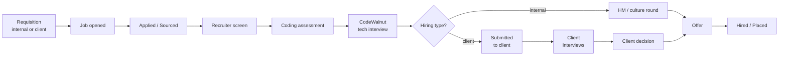

# SPEC — CodeWalnut ATS

The overview for CodeWalnut's applicant tracking system. It covers what cuts
across features: goals, hiring types, roles, the end-to-end pipeline,
non-functional requirements, the build plan and cross-cutting open questions.

**Detailed, testable requirements live in one file per feature under
[`docs/features/`](features/README.md)**, each with stable requirement IDs
(e.g. `SUB-06`). How to maintain them is described in that folder's README.

## Actor & goal

Recruiters, hiring managers, account managers and interviewers at CodeWalnut
run every hire — from a hiring request to a signed offer or placement — in one
system, replacing spreadsheets, email threads and ad-hoc forms. The firm hires
mostly developers at volume, so a technical assessment decides most outcomes
and is a first-class step.

CodeWalnut hires for **itself and for its clients**. Every job is one of:

| Hiring type | Who the hire works for | Who makes the offer |
| --- | --- | --- |
| **Internal** | CodeWalnut | CodeWalnut |
| **Client — deployed** | CodeWalnut, placed on a client project | CodeWalnut |
| **Client — direct placement** | The client | The client (ATS tracks it) |

Clients are records inside CodeWalnut's ATS, not tenants. Client users only
review what CodeWalnut submits to them, via secure links (ADR-0002).

### Goals

- One pipeline view per job: every candidate's stage, owner and next step
  visible in under 5 seconds.
- Structured, rubric-based interview feedback so decisions are consistent and
  auditable.
- Lower time-to-hire by automating recruiter admin (scheduling, emails,
  reminders).
- Built-in coding-assessment workflow.
- Fast, professional client submissions and structured client feedback.
- Strict client confidentiality: one client never sees another's data.
- Funnel reporting per job, recruiter and client without exporting to Excel.

### Success metrics (proposed, confirm with stakeholders)

| Metric | Target (6 months after launch) |
| --- | --- |
| Median time-to-hire | down 30% vs. month-1 baseline |
| Feedback submitted within 24 h of interview | ≥ 90% |
| Candidates with complete stage history | 100% |
| Recruiter hours spent scheduling per hire | down 50% |
| Median time-to-submit (client job opened → first shortlist) | ≤ 5 working days |
| Client feedback turnaround on submissions | median ≤ 3 working days |
| Offer acceptance rate | tracked per role, source and client |

## Users & roles

| Role | Who | Main jobs |
| --- | --- | --- |
| Admin | HR ops lead | Users, templates, settings, integrations, data requests |
| Recruiter | TA team | Own jobs, source & screen, move stages, schedule, submit, send offers |
| Hiring Manager | Delivery / engineering lead | Raise internal requisitions, review shortlists, decide |
| Account Manager | Owner of a client relationship | Client records, client requisitions, approve submissions, relay decisions |
| Interviewer | Engineers on panels | Assigned interviews, scorecards |
| Approver | Finance / leadership | Approve requisitions and offers above thresholds |
| Client Reviewer | External, client side | Review submissions via link, feedback, interview slots |
| Candidate | External | Apply, book slots, take assessments, respond to offers |

Staff sign in with Google; externals use magic links. Permissions are defined
per capability in [auth-and-users.md](features/auth-and-users.md) and enforced
by the API, with row scoping (own jobs, own clients, assigned interviews) added
per feature.

## End-to-end pipeline

Any stage can exit to Rejected (reason required), Withdrawn or On hold. Stage
templates, rules and SLAs are in [pipeline.md](features/pipeline.md).

## Features

| Prefix | Feature | Chunk | Status |
| --- | --- | --- | --- |
| AUTH | [Sign-in, users & roles](features/auth-and-users.md) | 0 | In progress |
| AUDIT | [Audit log](features/audit-log.md) | 0 | In progress |
| CLI | [Clients](features/clients.md) | 1 | Ready |
| REQ | [Requisitions](features/requisitions.md) | 1 | Ready |
| JOB | [Jobs & careers page](features/jobs-and-careers-page.md) | 1 | Ready |
| CAND | [Candidates](features/candidates.md) | 2 | Ready |
| PIPE | [Pipeline](features/pipeline.md) | 2 | Ready |
| MSG | [Email & communication](features/communication.md) | 3 | Ready |
| INT | [Interviews & scorecards](features/interviews-and-scorecards.md) | 4 | Ready |
| ASMT | [Coding assessments](features/assessments.md) | 5 | Draft |
| SUB | [Client submissions & review](features/client-submissions.md) | 6 | Ready |
| OFR | [Offers & placements](features/offers-and-placements.md) | 7 | Draft |
| PRIV | [Privacy, consent & retention](features/privacy-and-retention.md) | 8 (+ throughout) | Ready |
| ADM | [Admin & settings](features/admin-and-settings.md) | 0–8 | Ready |
| AI | [AI assistance](features/ai-assistance.md) | 2, v1 | Draft |
| PORTAL | [Candidate portal](features/candidate-portal.md) | v1 | Draft |
| RPT | [Reports](features/reports.md) | v1 | Draft |

## Tech stack

Decided in `docs/adr/0001-initial-architecture.md` and
`docs/adr/0003-mysql-everywhere.md`; module and data-model detail in
`docs/architecture.md`.

| Layer | Choice |
| --- | --- |
| Backend | Spring Boot 3 (Java 21), Maven, Spring Web, Spring Data JPA, Spring Security |
| Frontend | React + TypeScript (Vite) for staff UI and candidate portal |
| Careers pages | Server-rendered by Spring Boot (Thymeleaf) for SEO |
| Database | MySQL 8 everywhere — local dev, tests, CI and production — with Flyway migrations |
| Background work | MySQL outbox table (`background_task`) + `@Scheduled` workers |
| Auth | Google Workspace SSO for staff; magic links for candidates and client reviewers |
| Search | MySQL `FULLTEXT` on candidates and parsed CVs |
| Files | S3-compatible private storage, signed URLs |
| AI | One `LlmService` — advisory only |

## Cross-cutting rules

These apply to every feature; each feature file adds its own edge cases.

- **The API enforces access.** Hiding something in the UI is never the control.
  Unauthenticated → `401`; not allowed → `403` plus an audit entry.
- **Never fail silently.** Integration failures (calendar, email, assessment,
  e-sign) retry in the background and show a visible pending/failed state.
  Nothing is shown as sent when it wasn't.
- **Webhooks** are signature-verified and idempotent by external id.
- **Candidate-supplied content** (CVs, cover letters, emails) is data, never
  instructions — including when passed to an LLM.
- **Client isolation.** Client-facing data leaves only through submission
  snapshots scoped to one client.
- **History is append-only.** Stage events and the audit log are never edited.

## Non-functional requirements

Legal baseline assumed: India's DPDP Act 2023, plus GDPR for EU applicants.

| Area | Requirement |
| --- | --- |
| Privacy & retention | See [privacy-and-retention.md](features/privacy-and-retention.md) |
| Access control | RBAC in the API; job- and client-scoped row checks; compensation and bill rates masked by role |
| Client confidentiality | Client names hidden on confidential jobs; client users isolated to their own company's submissions |
| Security | Staff SSO; TLS; encryption at rest; signed expiring file URLs; CSRF protection; OWASP Top 10 review before launch |
| Audit | See [audit-log.md](features/audit-log.md) |
| Uploads | CVs ≤ 10 MB (PDF, DOCX); virus scan before parsing |
| Performance | 500-candidate pipeline board < 1.5 s p95; search < 500 ms on 100k candidates |
| Availability | 99.5% monthly for internal users; careers page on a CDN |
| Backups | Daily snapshots + point-in-time recovery, 7-day retention; quarterly restore test |
| Accessibility | WCAG 2.1 AA for careers page, candidate portal and client review page |
| Fairness | AI never ranks, auto-advances or auto-rejects; AI output labelled; rejection reasons logged |

## Not in scope (initially)

- Payroll, HRMS or post-offer onboarding (hand-off by integration only).
- A public job-board marketplace.
- An in-house proctored coding IDE.
- Multi-tenant SaaS where clients run their own hiring (ADR-0002).
- Invoicing and billing (placements exported for invoicing in v1).
- Vendor-management-system (VMS) integrations with clients' own ATSs.

## Build plan — PR-sized chunks

Rough estimate: MVP in ~12 weeks with 3 engineers + 1 designer; first live job
runs on the ATS in parallel with the old process by week 8. Each chunk ships
behind a feature flag with tests, a short demo, updated feature files, and an
ADR for any significant decision.

| # | Chunk | Weeks | Features | Done when |
| --- | --- | --- | --- | --- |
| 0 | Foundations | 1 | AUTH, AUDIT, ADM (users) | A user signs in and sees role-based navigation |
| 1 | Clients, requisitions & jobs | 2 | CLI, REQ, JOB | A public applicant appears on an internal job and a confidential client job |
| 2 | Candidates & pipeline | 3–4 | CAND, PIPE, AI-01 | A recruiter runs a full pipeline without a spreadsheet |
| 3 | Email | 5 | MSG | All candidate emails live on the timeline |
| 4 | Interviews & scorecards | 6–7 | INT | A panel interview is scheduled and scored in-app |
| 5 | Assessments | 8 | ASMT | Pilot job goes live in parallel |
| 6 | Client submissions & review | 9–10 | SUB | A real client shortlists a candidate through the review link |
| 7 | Offers & placements | 11 | OFR | An internal offer is signed and a direct placement recorded |
| 8 | Hardening | 12 | PRIV, ADM (import), perf, security review | Launch checklist signed off |
| v1 | Next version | 13–18 | RPT, PORTAL, client portal, commercials, job boards, Slack, referrals, talent pool, AI summaries, HRMS | Ordered by pilot feedback |

## Open questions (cross-cutting)

Feature-specific questions live in each feature file.

- [ ] Build vs. buy: why not Greenhouse, Lever, Zoho Recruit or Keka Hire?
- [ ] Volume: open roles, applicants/month, number of recruiters?
- [x] Internal only, or also for clients? → **Both** (ADR-0002).
- [x] Client engagement models? → **Both** deployed and direct placement, MVP.
- [x] Client login in MVP? → **No**, review link only; client portal in v1.
- [ ] Hosting preference; ISO 27001 / SOC 2 or client compliance constraints?
- [ ] Product owner and pilot recruiter?
